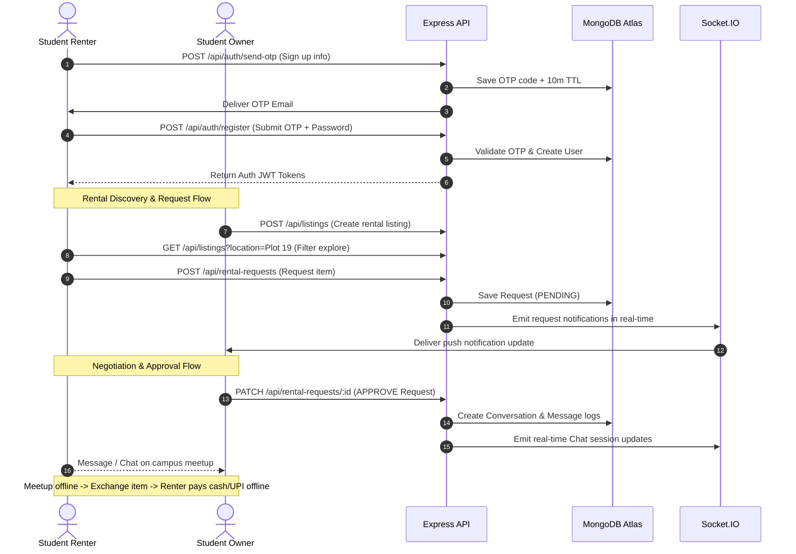

# Rentora - Complete Project Specification & Technical Guide

Welcome to the comprehensive specification and guide for **Rentora**, a peer-to-peer student rental marketplace designed exclusively for Noida Institute of Engineering and Technology (NIET) campuses.

This document serves as a technical blueprint for AI coding agents and developers to understand the design, architecture, database schemas, and workflows of the application.

---

## 1. Project Overview & Core Concept

Rentora enables NIET students to rent items (textbooks, calculators, lab coats, electronics, etc.) to and from one another.

- **Closed Eco-system**: Restricts registration to students possessing a verified `@niet.co.in` email address.
- **Offline Payments**: The platform coordinates listing, discovery, rental requests, real-time messaging, and notifications. Financial transactions and physical item exchanges are handled offline between students on campus.
- **Moderation**: Admin dashboard monitors user statuses (active/blocked) and lists reported/flagged listings for review.

---

## 2. Technology Stack

### Frontend (client/)

- **Core**: React 18, TypeScript, Vite (build tool).
- **Styling**: TailwindCSS (utility classes), Vanilla CSS custom tokens, Outfit & Inter typography.
- **Routing**: React Router DOM (v6).
- **State Management**: React Context API (`AuthContext`, `SocketContext`, `WishlistContext`).
- **Icons**: `lucide-react`.
- **Build Target**: Modern ES browsers.

### Backend (server/)

- **Core Runtime**: Node.js, Express.js (REST API framework), TypeScript.
- **Development tool**: `ts-node-dev` (auto-reloads and compiles TypeScript in-memory).
- **Database**: MongoDB Atlas (Cloud hosted database using `mongoose` ODM).
- **Real-time Communications**: `socket.io` (handles chat synchronization and active notifications).
- **File Uploads**: `multer` + `cloudinary` integration (falls back to mock links if Cloudinary tokens are absent).
- **Security & Utilities**: `bcryptjs` (password hashing), `jsonwebtoken` (JWT creation/validation), `zod` (runtime schema validations), `express-rate-limit` (prevents API abuse).

---

## 3. Database Models & Schema Design (Mongoose)

### 3.1. User Model (`user.model.ts`)

Stores accounts. Supports student roles and administrative moderators.

```typescript
{
  fullName: { type: String, required: true },
  email: { type: String, required: true, unique: true, lowercase: true },
  passwordHash: { type: String, required: true },
  role: { type: String, enum: ['STUDENT', 'ADMIN'], default: 'STUDENT' },
  course: { type: String, required: true },
  branch: { type: String, required: true },
  year: { type: Number, required: true },
  collegeName: { type: String, required: true }, // NIET Plot 19, Plot 15, or Plot 14
  avatar: { type: String }, // Dicebear SVG or Cloudinary URL
  bio: { type: String, default: '' },
  isVerified: { type: Boolean, default: false }, // Verified via email OTP
  isBlocked: { type: Boolean, default: false }, // Toggled by Admin
  ratingAverage: { type: Number, default: 0 },
  ratingCount: { type: Number, default: 0 },
  completedRentals: { type: Number, default: 0 }
}
```

### 3.2. Listing Model (`listing.model.ts`)

Stores items uploaded by students for rent.

```typescript
{
  title: { type: String, required: true },
  description: { type: String, required: true },
  category: { type: Schema.Types.ObjectId, ref: 'Category', required: true },
  condition: { type: String, enum: ['NEW', 'LIKE_NEW', 'GOOD', 'FAIR'], required: true },
  rentalPrice: { type: Number, required: true },
  priceUnit: { type: String, enum: ['HOUR', 'DAY', 'WEEK', 'MONTH'], default: 'DAY' },
  securityDeposit: { type: Number, required: true },
  images: [{ type: String }],
  owner: { type: Schema.Types.ObjectId, ref: 'User', required: true },
  availability: { type: Boolean, default: true },
  status: { type: String, enum: ['ACTIVE', 'PAUSED', 'REMOVED'], default: 'ACTIVE' },
  location: { type: String, required: true }, // Campus plot locations
  viewCount: { type: Number, default: 0 },
  requestCount: { type: Number, default: 0 }
}
```

### 3.3. OTP Verification Model (`otp.model.ts`)

A lightweight, indexed table for active signup or login OTP codes. Uses MongoDB's native Time-To-Live index to auto-delete documents.

```typescript
{
  email: { type: String, required: true, unique: true, lowercase: true },
  otp: { type: String, required: true },
  expiresAt: { type: Date, required: true, index: { expires: '10m' } } // Auto-purges after 10 mins
}
```

### 3.4. Rental Request Model (`rentalRequest.model.ts`)

Handles the request proposal submitted by a potential renter.

```typescript
{
  listing: { type: Schema.Types.ObjectId, ref: 'Listing', required: true },
  owner: { type: Schema.Types.ObjectId, ref: 'User', required: true },
  renter: { type: Schema.Types.ObjectId, ref: 'User', required: true },
  startDate: { type: Date, required: true },
  endDate: { type: Date, required: true },
  message: { type: String },
  status: {
    type: String,
    enum: ['PENDING', 'APPROVED', 'REJECTED', 'COMPLETED', 'CANCELLED'],
    default: 'PENDING'
  }
}
```

### 3.5. Report Model (`report.model.ts`)

Holds flagged content reports filed by students.

```typescript
{
  reportedBy: { type: Schema.Types.ObjectId, ref: 'User', required: true },
  targetType: { type: String, enum: ['LISTING', 'USER'], required: true },
  targetId: { type: Schema.Types.ObjectId, required: true },
  reason: { type: String, required: true },
  description: { type: String, default: '' },
  status: { type: String, enum: ['OPEN', 'REVIEWING', 'RESOLVED', 'DISMISSED'], default: 'OPEN' },
  resolvedAt: { type: Date }
}
```

---

## 4. Authentication & Real-Time SMTP OTP Configuration

### 4.1. Verification Lifecycle

1. **Send OTP**:
   - API: `POST /api/auth/send-otp` (Registration) or `/api/auth/login-send-otp` (Login).
   - Schema checks that the domain matches `@niet.co.in` (if domain restrictions are active).
   - Generates a 6-digit numeric OTP code.
   - Caches code under `Otp` collection.
2. **Delivery**:
   - Uses Nodemailer helper `sendOTPEmail(email, otp, type)`.
   - Reads SMTP configurations from environment.
   - If credentials are missing or fail, it logs the code to the terminal console and offers a mock **Ethereal Mail** link for testing.
3. **Verification**:
   - Student submits registration info or login form with OTP.
   - API checks matching OTP in the database. On match, sets user `isVerified = true`, deletes the OTP document, signs the JWT, and logs the user in.

### 4.2. Environment Configurations (`.env`)

```env
PORT=5001
NODE_ENV=development
MONGODB_URI=mongodb+srv://<user>:<pass>@<cluster>.mongodb.net/rentora
JWT_ACCESS_SECRET=super_secret_access_key_123_abc_xyz
JWT_REFRESH_SECRET=super_secret_refresh_key_456_def_uvw
CLIENT_URL=http://localhost:5173
ALLOWED_EMAIL_DOMAIN=niet.co.in

# SMTP Real-time OTP config
SMTP_HOST=smtp.gmail.com
SMTP_PORT=587
SMTP_USER=
SMTP_PASS=
```

---

## 5. Frontend UI/UX Design System

- **Colors**: Curated rich indigo, deep grey backgrounds (`dark:bg-slate-950`), custom red gradients for visual logos, and vibrant accent badges (green for Active, amber for Pending, red for Removed).
- **Component-driven**: Custom SVG Line Graphs (native SVG path calculations for performance), micro-animations (`animate-in fade-in`), clean cards for products, and step-by-step registration wizard templates.
- **Layout Isolation**: Separate `MainLayout` for students (Explore, Bag, Chat, Messages) and `AdminLayout` with sidebar controls for admin views.

---

## 6. Key Application Workflows



---

## 7. Administrative Moderation Actions

1. **User Moderation**:
   - Admin can toggle block status (`PATCH /api/admin/users/:id/block`). Blocked accounts are restricted from logging in.
2. **Flagged Queue**:
   - Students report listings via a "Flag" modal.
   - Reports show up on the admin panel: `GET /api/admin/reports`.
   - Admin has a unified **"Take Down & Resolve"** action that marks the listing status as `REMOVED` and marks the report as `RESOLVED`.
3. **Direct Take-down**:
   - Admins browsing any item page will see a red **Admin Moderation Tools** box on the detail view, allowing instant take-downs (`DELETE /api/admin/listings/:id`).

---

## 8. Trust, Safety & Transaction Workflows

### 8.1. Handover Verification OTP
* **Lifecycle**:
  - When the owner approves a rental request, the status transitions to `ACCEPTED`, and a temporary 4-digit **Handover OTP** is generated.
  - The renter retrieves this OTP from their "Rental Requests" dashboard.
  - When they meet physically on campus, the owner inputs this OTP into their "Confirm Handover" panel.
  - If valid, the rental starts (status becomes `ACTIVE`).

### 8.2. Digital Wallet holding system
* **Mock Wallet**:
  - Every student gets a mock wallet balance (`walletBalance`, default ₹5,000) displayed in the Navbar.
  - **Deduction & Hold**: Upon handover validation (OTP verified), the total cost (`rentalPrice * days` + `securityDeposit`) is deducted from the renter's wallet. The security deposit is held digitally on the platform.
  - **Return & Refund**: When the owner inspects the returned item and confirms it on the dashboard, the security deposit is refunded back to the renter's wallet, and the rental fee is paid directly to the owner's wallet.

### 8.3. Calendar Date-Picker Overlap Prevention
* **Availability Block**:
  - Active bookings (status `ACCEPTED` or `ACTIVE`) block out dates on the listing's calendar.
  - When submitting a new rental request, the frontend and backend validate that the selected dates do not overlap with any existing booked ranges.

### 8.4. Institutional College Security Deposit Deduction Policy (Terms & Conditions)
* **Unreturned or Damaged Item Recourse**:
  - If a student borrower defaults on returning a borrowed item or causes irreversible damage without compensating the owner, the case is referred to the **NIET College Administration & Proctorial Board**.
  - The replacement value + outstanding rental fee is deducted directly from the student's **institutional security money / caution deposit** submitted to NIET.
  - Academic holds (withholding admit cards, degrees, no-dues clearance) are instituted until restitution is fulfilled.


